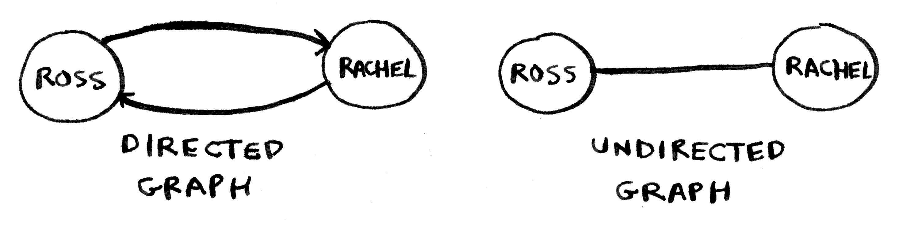

# 第6章 广度优先搜索

## 广度优先搜索

+ 广度优先搜索，breadth-first search，BFS
+ 广度优先搜索是一种用于图的查找算法，可以帮助回答两类问题：
  1. 从节点A出发，有前往节点B的路径吗？
  2. 从节点A出发，前往节点B的哪条路径最短？

+ 队列（Queue）是一种**先进先出**（First In First Out, FIFO）的数据结构
+ 栈（Stack）是一种**后进先出**（Last In First Out, LIFO）的数据结构

***

## 实现图

+ 散列表可以将键映射到值，因此可以表示图中节点和边
+ 散列表是无序的，因此添加键值对的顺序随意
+ 有向图的关系是单向的；无向图的关系是双向的
+ 下面两个图示等价的：
  
  
  <!--  -->

+ 图的实现代码：
  ``` Python
  graph = {}
  graph["you"] = ["alice", "bob", "claire"]
  graph["bob"] = ["anuj", "peggy"]
  graph["alice"] = ["peggy"]
  graph["claire"] = ["thom", "jonny"]
  graph["anuj"] = []
  graph["peggy"] = []
  graph["thom"] = []
  graph["jonny"] = []
  ```
+ 上面的代码表示了下图的关系：
  
  
  <!--  -->

***

## 实现算法

``` Python
# -*- coding: utf-8 -*-
# 广度优先搜索
# 2019-06-08

from collections import deque

graph = {}
graph["you"] = ["alice", "bob", "claire"]
graph["bob"] = ["anuj", "peggy"]
graph["alice"] = ["peggy"]
graph["claire"] = ["thom", "jonny"]
graph["anuj"] = []
graph["peggy"] = []
graph["thom"] = []
graph["jonny"] = []

def search(name):
    search_queue = deque()
    search_queue += graph[name]
    searched = []       # 用于记录检查过的人
    while search_queue:     # 只要队列不为空
        person = search_queue.popleft()
        if not person in searched:      # 仅当这个人没检查过时才检查
            if person_is_seller(person):    # 检查这个人
                print(person + " is a mango seller!")
                return True
            else:
                search_queue += graph[person]   # 不是，将这个人的朋友都加入搜索队列
                searched.append(person)     # 将这个人标记为检查过
    return False

def person_is_seller(name):
    return name[-1] == 'm'

search("you")
```


